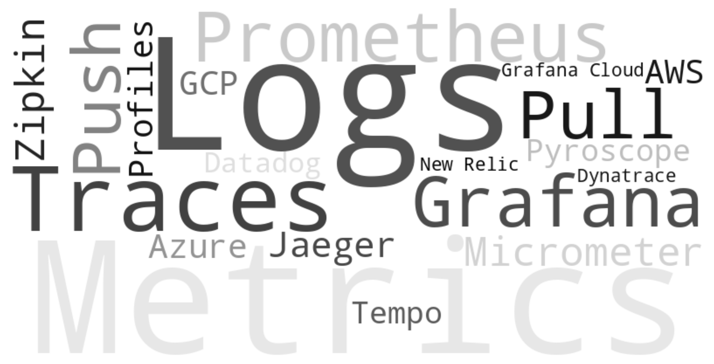

## OpenTelemetry

---



---

## OpenTelemetry

OpenTelemetry is a set of standardized protocols, tools and libraries for instrumenting to provide observability for applications.

---

## OpenTelemetry

* Standardized metrics, logs and traces
* Federated by Cloud Native Computing Foundation (CNCF)
* Language SDKs:
  * Instrument your application and emit Metrics, Logs, Traces as signals
  * Java SDKs:
    * [Agent](https://github.com/open-telemetry/opentelemetry-java-instrumentation)
    * [Spring Boot Starter](https://opentelemetry.io/docs/zero-code/java/spring-boot-starter/)
    * [Quarkus OpenTelemetry extension](https://quarkus.io/guides/opentelemetry)
* OpenTelemetry Collector:
  * Receives, processes and exports telemetry data to a backend
  * Available as Binary, Docker image, Kubernetes Operator, Grafana Alloy

---

# Demo

1. Provision an observability stack and a Demo Application
```
just provision-opentelemetry-docker-compose
```

2. Observe `http://localhost:3000/`

3. Simulate successful aggregation of 1000000 smart meter values
```
curl -L -X POST 'http://localhost:8080/smartMeters/randomSmartMeterValues?meterCount=1000000'
curl -L 'http://localhost:8080/smartMeters/sum'
```

---

# Demo


---

# If have been using Prometheus

- `UP` metric not available
  - A [Health Check Extension](https://github.com/open-telemetry/opentelemetry-collector-contrib/blob/main/extension/healthcheckv2extension/README.md) as a replacement
- [Histograms](https://opentelemetry.io/docs/specs/otel/compatibility/prometheus_and_openmetrics/)
  - OpenTelemetry implements Exponential (Native) Histograms
  - Prometheus Histogram feature in-progress is `--enable-feature=native-histograms`

---

# How to migrate from Prometheus?

1. OpenTelemetry collector provides Prometheus receiver (drop-in-replacement) 
```
receivers:
  otlp:
    protocols:
      grpc:
        endpoint: 0.0.0.0:4317
      http:
        endpoint: 0.0.0.0:4318
  prometheus:
    config:
      scrape_configs:
        - job_name: 'demo-app'
          static_configs:
            - targets: ['demo-app:8080']
```
2. Switch off direct Prometheus scraping
3. Replace Java SDK instrumentation with OpenTelemetry Java Agent (or other SDKs)

---

# References

- [OpenTelemetry](https://opentelemetry.io/docs/)
- [Grafana docs](https://grafana.com/docs/)
- [Application Observability Code Challenge 1 by Cees Bos](https://openvalue.blog/posts/2025/01/17/aocc-challenge-01/)

---

# Q&A